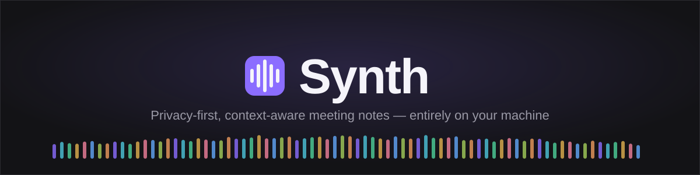

<div align="center">



[](LICENSE.md)
[](#building-from-source)
[](https://tauri.app/)

</div>

---

Synth captures meetings, lectures, and conversations, transcribes them locally, identifies who said what, and generates a summary shaped to what you were actually doing — a work meeting, a lecture, a study group, or a casual chat — all without a single byte of audio or transcript leaving your machine unless you explicitly choose a cloud AI provider for summarization.

It's a fork of [Meetily](https://github.com/Zackriya-Solutions/meetily) (MIT licensed), rebranded and extended with real speaker diarization, Notion-style personal organization, multi-source sessions (transcript + your files + your own notes, synthesized together), and context-adaptive summary templates. See [PROJECT_BRIEF.md](PROJECT_BRIEF.md) for the full design rationale and [CLAUDE.md](CLAUDE.md) for the technical architecture reference.

## Features

- **Local-first transcription** — Whisper.cpp or Parakeet, running on-device with GPU acceleration (Metal on macOS, CUDA/Vulkan on Windows and Linux). No audio ever has to touch a server.
- **Live recording workspace** — a resizable split view: live transcript on one side, a rich-text notes editor on the other, so you can write your own notes alongside what's being said as it happens.
- **Real speaker diarization** — a Rust + ONNX pipeline (pyannote segmentation + speaker embeddings) identifies distinct speakers and labels transcript turns automatically.
- **Context-adaptive AI summaries** — five built-in templates (meeting, lecture, discussion, coffee chat, custom) that each shape the summary differently: a lecture summary extracts key concepts and homework; a meeting summary extracts decisions and action items. Bring your own AI provider — local (Ollama, or Synth's own bundled model) or cloud (Claude, Groq, OpenRouter, OpenAI-compatible endpoints).
- **Multi-source sessions** — attach files (PDFs, docs, images) and write your own notes into the same session as the transcript; the summary synthesizes all of it together.
- **Personal organization** — a Notion-style folder tree with drag-and-drop, nested folders, per-session tags, and a cross-session action-item view, plus full-text search across every transcript you've recorded.
- **Flexible export** — a self-contained shareable HTML page, PDF, or DOCX, each with a **Raw / AI-cleaned** toggle: the cleaned option strips filler words and reflows the transcript into readable paragraphs per speaker, without losing who-said-what.
- **Import & retranscribe** — bring in an existing audio file and transcribe it locally, or re-run a past recording through a different model or language.
- **Genuinely local-first** — a single SQLite file is the entire backend. No server, no account, no hosting cost. There's nothing to run out or pay for.

## Building from source

Synth doesn't ship signed installers — you build and run it yourself.

**Prerequisites:** [pnpm](https://pnpm.io/), [Rust](https://rustup.rs/) (stable, ≥1.88), [CMake](https://cmake.org/), and on macOS a full Xcode install (`xcodebuild -runFirstLaunch`).

```bash
git clone https://github.com/shotuu/synth
cd synth/frontend
pnpm install

# macOS
./clean_run.sh          # dev build + run
./clean_build.sh         # production build (.app)

# Windows
clean_run_windows.bat
clean_build_windows.bat
```

GPU acceleration is enabled automatically at build time based on your platform (Metal on macOS, CUDA/Vulkan via Cargo feature flags on Windows/Linux — see `pnpm run tauri:dev:cuda` / `:vulkan` / `:cpu`). For Linux build steps, see [docs/building_in_linux.md](docs/building_in_linux.md); for the general reference, [docs/BUILDING.md](docs/BUILDING.md).

A production build (`./clean_build.sh`) is only ad-hoc signed — on first launch, macOS Gatekeeper will refuse to open it. Right-click the app → **Open** once to bypass that, then grant it microphone and screen-recording permission when prompted (needed to capture system audio).

## Architecture

Synth is a single, self-contained Tauri 2 application: a Rust core handles audio capture, transcription, diarization, and storage; a Next.js frontend renders the UI. There is no separate backend service to run or deploy. See [docs/architecture.md](docs/architecture.md) for the diagram-level overview, and [CLAUDE.md](CLAUDE.md) for where each piece of functionality actually lives in the codebase.

## Contributing

Issues and pull requests are welcome. See [CONTRIBUTING.md](CONTRIBUTING.md).

## License

MIT — see [LICENSE.md](LICENSE.md). Synth is a derivative of [Zackriya-Solutions/meetily](https://github.com/Zackriya-Solutions/meetily); the original project's copyright notice is preserved.

## Acknowledgments

- Built on top of [Meetily](https://github.com/Zackriya-Solutions/meetily) by Zackriya Solutions — the native audio capture pipeline, local transcription, and pluggable summarization layer all originate there.
- Uses [Whisper.cpp](https://github.com/ggerganov/whisper.cpp) for local transcription.
- Uses NVIDIA's **Parakeet** model, via the [ONNX conversion](https://huggingface.co/istupakov/parakeet-tdt-0.6b-v3-onnx) by istupakov.
